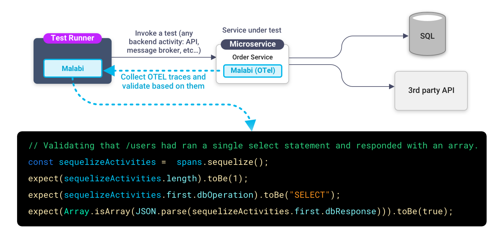

<p>

</p>

 <a href="https://github.com/aspecto-io/malabi/blob/master/LICENSE">
    
  </a>
<a href=''></a>

# OpenTelemetry based Javascript Test framework

** 💻 Developer friendly**: Built for developers, by developers who love distributed applications.

** ✅ Validate integration**: Access to validate any backend interaction, fast, simple and reliable.

** 🔗 OpenTelemetry based**: Built based on OpenTelemetry to match the characteristics of distributed apps.


## How it works


There are two main components to malabi:

1. An OpenTelemetry SDK Distribution - used to collect any activity in the service under test by instrumenting it. it will also serve the collected data to the test runner for validation purposes

2. An assertion library for OpenTelemetry data - by using `fetchRemoteTests` function you will get access to any span created by the current test, then you will be able to validate the span and the service behavior
```JS
// get spans created in the context of test
const spans = await getMalabiExtract();

// Validating that /users had ran a single select statement and responded with an array.
const sequelizeActivities =  spans.sequelize();
expect(sequelizeActivities.length).toBe(1);
expect(sequelizeActivities.first.dbOperation).toBe("SELECT");
expect(Array.isArray(JSON.parse(sequelizeActivities.first.dbResponse))).toBe(true);
```

## Why should you care about Malabi
Most distributed apps developers choose to have some kind of black box test (API, integration, end to end, UI, you name it 😎).

Black box test create real network activity which is instrumentated by OpenTelemetry (which you should have regardless to Malabi).

Imagine that you can take any existing black box test and validate any backend activity created by it.

#### Common use case
You are running an API call that create an new DB record, then you write dedicated test code to fetch the record created and validate it. 
Now you can rely on Malabi to validate it with no special code `(await getMalabiExtract()).mongodb()`

## Take it for a test ride
You can find an example service and test to show case how it works.

1. In the **project root** run `yarn` to install dependencies, followed by `yarn build`.

2. Start the **service-under-test** by running:
```sh
yarn --cwd examples/service-under-test start
```
3. In a different terminal process, run the tests:
```sh
yarn --cwd examples/tests-runner test:example
```

[Go to example](https://github.com/aspecto-io/malabi/tree/master/examples/README.md)
